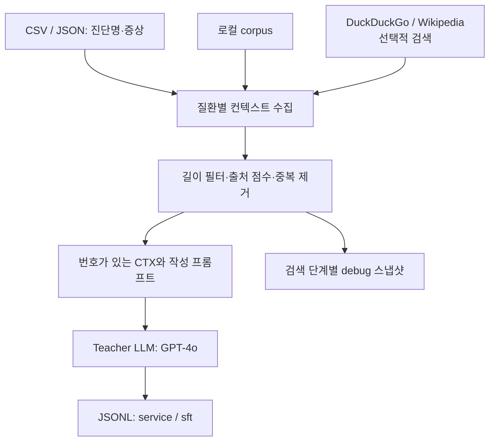

# PET-I · Explanation Data

[](https://github.com/ho72/pet-i-explanation-data/actions/workflows/checks.yml)

**진단명과 증상에 검색 근거를 붙여 반려견 안구 질환 설명문과 SFT 학습 데이터를 만드는 Python 파이프라인입니다.**

PET-I의 VLM 학습에 사용할 설명형 데이터를 준비하기 위해 구현한 모듈입니다. CSV 또는 JSON으로 주어진 진단명·증상을 읽고, 질환별 로컬 문서와 선택적 웹 검색 결과를 모아 Teacher LLM에 전달합니다. 결과는 서비스용 설명문과 검색·열람 대화 형식의 학습 레코드로 저장합니다.

이미지를 직접 분석하거나 질환을 새로 판별하는 기능은 이 저장소에 없습니다. `image_path`는 입력 식별자를 만드는 데 사용합니다. VLM 학습·평가와 전체 서비스 구조는 [PET-I-VLM-Diagnosis](https://github.com/ho72/pet-i-vlm-diagnosis)를 참고하세요.

[데이터 출처와 구성](docs/DATA_SOURCES.md) · [입출력 형식](docs/DATA_FORMAT.md) · [실행 안내](docs/SETUP.md) · [파이프라인 설계와 한계](docs/PIPELINE.md) · [기존 생성 예시](docs/GENERATED_EXAMPLES.md)

## 프로젝트와 담당 역할

- **전체 프로젝트:** PET-I — VLM 기반 반려견 안구 질환 진단·설명 서비스, 건국대학교 4인 졸업프로젝트(2025.03~2025.12).
- **본인 담당:** 설명형 학습 데이터 생성과 전체 데이터 전처리, RAG/Web Search 파이프라인 구현. 이 저장소는 설명형 데이터 생성 코드를 보여줍니다.
- **팀 결과와의 관계:** 최종 학습 데이터는 진단 JSON·진단 Markdown·설명형·챗봇형으로 구성되었습니다. 증상 추출·챗봇 데이터 생성과 서비스의 최종 통합에는 팀원도 참여했습니다.

전체 모델의 분류 성능을 이 데이터 생성 모듈 단독의 성과로 표현하지 않습니다.

## 데이터 출처와 형식

PET-I 전체 프로젝트의 원본 이미지·라벨 출처는 AI Hub의 [반려동물 안구 질환 데이터](https://www.aihub.or.kr/aihubdata/data/view.do?currMenu=115&dataSetSn=562&topMenu=100)입니다. 공식 학습용 데이터는 JPG 이미지와 JSON 라벨로 제공됩니다. 프로젝트에서는 이 중 반려견 데이터의 7개 분류 항목으로 5,600장을 선별·전처리했습니다. 이는 전체 VLM 프로젝트의 이미지 준비 규모이며, 이 레포의 설명문 생성 건수는 아닙니다.

| 구분 | 출처 | 형식과 사용 |
| --- | --- | --- |
| 원본 | AI Hub | JPG + 라벨 JSON. 이 레포에는 원본 데이터 미포함 |
| 입력 | 앞선 전처리 단계 | 진단명·증상을 담은 CSV 또는 프로젝트용 JSON |
| 문서 | 프로젝트 [corpus](corpus/) | TXT 7개. 문서별 원문 출처·작성 이력 미기록 |
| 검색 | DuckDuckGo·Wikipedia | 제목·URL·발췌. 일부 상황에서는 저장된 시드 문서 사용 |
| 출력 | GPT-4o 생성 | JSONL의 `service` 설명문과 `sft` 학습 대화 |

공개 CSV는 **입력 형식을 보여주는 3건의 예시**이고, JSON 1건은 그 첫 행으로 구성한 형식 예시입니다. CSV 각 행을 원본 AI Hub 이미지·라벨과 대조한 매핑 기록은 없으므로 실제 학습 데이터의 일부라고 단정하지 않습니다. AI Hub 원본에 완성된 설명문이나 이 저장소의 SFT 대화가 포함되어 있다는 의미도 아닙니다.

최종 보고서 §5.3에는 팀 학습 구성 중 설명형 데이터 **2,040개**(기본 1,020개 × 2)가 기록되어 있습니다. 이는 보고서의 최종 팀 데이터 구성 수치이며, 이 레포의 현재 CLI 실행 로그나 공개 샘플 수를 뜻하지 않습니다. 이 코드로 생성한 전체 실행 건수·필터 통과 건수·학습/평가 매핑은 별도로 검증하지 않았습니다. 단계별 출처와 공개 파일 목록은 [데이터 구성 안내](docs/DATA_SOURCES.md), 구체적인 필드 예시는 [입출력 형식](docs/DATA_FORMAT.md)에서 확인할 수 있습니다.

## 데이터 생성 흐름



| 단계 | 구현 내용 |
| --- | --- |
| 입력 정규화 | CSV의 `image_path`, `diagnosis`, `symptoms` 또는 JSON 입력을 공통 구조로 변환 |
| 근거 수집 | 진단명과 연결된 로컬 문서, 선택적으로 DuckDuckGo 검색 요약·영문 Wikipedia 본문 수집 |
| 컨텍스트 구성 | 문서 길이·선호 도메인·중복 URL/제목을 기준으로 선별하고 `[번호]` 부여 |
| 설명 생성 | 질병 설명·진단 근거·주요 발생 원인·관리 방법의 네 섹션을 요청 |
| 데이터 저장 | 생성 성공 시 `service`·`sft`, 실패 시 `error`, 미리보기는 `preview`로 저장 |

`sft`의 `search`·`fetch` 대화는 수집된 문서로 **코드가 구성한 학습용 기록**입니다. Teacher LLM이 직접 도구를 호출한 실행 로그는 아닙니다.

## 저장소 구성

```text
pet-i-explanation-data/
├── auto_ctx.py                   # 입력·검색·생성·JSONL 저장
├── requirements.txt             # 확인한 의존성·lock 제약
├── requirements-dev.txt         # 테스트·정적 검사 도구
├── tests/                       # 외부 호출 없는 회귀 테스트
├── .github/workflows/           # GitHub Actions 검사
├── corpus/                      # 질환별 로컬 텍스트 문서
├── data/
│   ├── sample_input.csv          # 기존 CSV 샘플 3건
│   └── example_input.json        # JSON 입력 형식 예시 1건
└── docs/
    ├── SETUP.md                  # 설치·실행·문제 해결
    ├── DATA_SOURCES.md           # 원본·입력·근거·생성 데이터 출처
    ├── DATA_FORMAT.md            # 입력·출력 스키마
    ├── PIPELINE.md               # 함수별 흐름과 구현 한계
    ├── GENERATED_EXAMPLES.md     # 기존 README의 생성 예시
    └── VALIDATION.md             # 공개 코드 개선·회귀 검사
```

## 빠른 시작

```bash
git clone https://github.com/ho72/pet-i-explanation-data.git
cd pet-i-explanation-data
python3.12 -m venv .venv
source .venv/bin/activate
python -m pip install -r requirements.txt
python auto_ctx.py --help
python auto_ctx.py --csv data/sample_input.csv --out outputs/preview.jsonl --k 4 --dry-run
```

**먼저 실행하는 `--dry-run`은 외부 검색·LLM 호출 없이 컨텍스트와 프롬프트만 확인합니다.** 결과는 `preview` 레코드이며 학습 데이터가 아닙니다.

실제 설명 생성을 하려면 Teacher LLM 호출에 사용할 키를 셸의 `OPENAI_API_KEY` 환경변수로 설정한 뒤 실행합니다. 실제 키를 소스나 Git에 저장하지 마세요. LLM 실행에는 API 사용량에 따른 비용이 발생합니다.

```bash
python auto_ctx.py \
  --csv data/sample_input.csv \
  --out outputs/explanations.jsonl \
  --k 20 \
  --use_ddg --use_wiki
```

모델 선택(`--model`·`OPENAI_MODEL`), 로컬 문서 실행, 실패 레코드와 종료 코드는 [실행 안내](docs/SETUP.md)에 있습니다.

## 현재 범위와 확인 사항

- `meta.quality`는 섹션 설정·근거 URL·증상 입력·출력 길이 등의 간단한 상태 정보를 저장합니다. 인용 정확성이나 수의학적 타당성을 검증하거나 부적합 데이터를 자동 제외하지는 않습니다.
- 키 미설정·생성 실패·빈 응답·중단 출력은 `error` 레코드로 분리하고 정상 `service`·`sft`를 저장하지 않습니다. 성공·dry-run·실패 유형과 종료 코드를 구분합니다.
- 임베딩·벡터 DB·LangChain 실행 코드는 이 파이프라인에 없습니다.
- 로컬 매핑은 무증상을 포함한 7개 분류를 지원합니다. 문서 부족 시 수집한 입력·검색 근거를 보존하며 길이 필터를 완화합니다. [상세 안내](docs/PIPELINE.md)를 참고하세요.

2026.10.06에는 API 키 자리표시자의 구문 오류와 소개 문서를 정리했습니다. **2026.10.07에는 실패 출력 분리·dry-run·컨텍스트 보존·입력/설정 처리와 테스트·CI를 추가했습니다.** Python 회귀 테스트 31개와 정적 검사가 통과했습니다. 웹 검색·GPT-4o 실제 설명 생성·VLM 재학습은 실행하지 않았습니다. [검증 범위](docs/VALIDATION.md)를 따릅니다.

## PET-I 개인 저장소

| 저장소 | 역할 |
| --- | --- |
| [PET-I-VLM-Diagnosis](https://github.com/ho72/pet-i-vlm-diagnosis) | 전체 프로젝트 소개와 VLM 학습·평가·서비스 코드 |
| [PET-I-Explanation-Data](https://github.com/ho72/pet-i-explanation-data) | 설명형 데이터 생성 파이프라인 — 현재 저장소 |

생성 예시는 모델 출력의 기록이며, 수의학적 정확성이 검증된 진단·치료 안내로 사용하지 않습니다.
